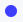

# Carrefour Links VueJS Utilities

## Description

This project contains common components for Carrefours links Front Ends build with VueJS.
Components are classified in the following directory structure:

- Common: components that have no dependency, they can be used with a direct import.
- Icons: components that are SVG icons with **"[vue-svg-inline-loader](https://www.npmjs.com/package/vue-svg-inline-loader)"** module.
- TailWind: components that use tailwind CSS classes and styles, **"[tailwindcss](https://tailwindcss.com/)"** module.

## Common components

### Alert

Alert is a simple panel to display an alert or an error message.


#### Properties

Name            | Type    | Required | Default     | Description
--------------- | ------- | -------- | ----------- | --------------------------------------------------------
summary         | String  | X        |             | The summary string to display.
details         | String  |          |             | The details string to display.
closable        | Boolean |          | true        | Display a closable button.
backgroundColor | String  |          | #ff8888     | The background color.
color           | String  |          | #EEE        | The background color.
iconVisible     | Boolean |          | true        | Display an icon.
iconName        | String  |          | icon-danger | The icon name ('icon-info', 'icon-help', 'icon-danger').
iconColor       | String  |          | #EEE        | The icon color.
iconSize        | String  |          | 32px        | The icon size.

#### Events

Name            | Parameters                       | Description
--------------- | -------------------------------- | ---------------------------------------------
close           |                                  | Callback to invoke when close is performed.

#### Getting started

```vuejs
  <Alert
    v-if="showError"
    summary="An error occurred."
    details="Please try again later"
    @close="onCloseAlert"
  />
```

### AnimatedPing

AnimatedPing is a small animated bullet loader.



#### Properties

Name            | Type    | Required | Default     | Description
--------------- | ------- | -------- | ----------- | ----------------------------------------------
visible         | Boolean |          | false       | Display or not the component.
size            | String  |          | 0.5rem      | The size of the component.
color           | String  |          | #8B979E     | The color of the component.

#### Getting started

```vuejs
  <AnimatedPing 
    :visible="true"
    size="125px"
    color="blue"
  />
```

### Button

Button provides a simple UI button with an optional icon.


#### Properties

Name            | Type    | Required | Default     | Description
--------------- | ------- | -------- | ----------- | ----------------------------------------------
label           | String  | X        |             | The Label text of the button.
icon            | String  |          | null        | The icon if specified.
disabled        | Boolean |          | false       | The disabled state of the button.
shadow          | Boolean |          | false       | Display shadows or not.

#### Getting started

```vuejs
  <Button
    label="Start"
    :disabled="false"
    :shadow="true"
    @click="onClickStart"
  />
```

### Loader

Loader provides down fall squares animated loader.


#### Properties

Name            | Type    | Required | Default     | Description
--------------- | ------- | -------- | ----------- | --------------------------------------------------------
fixed           | Boolean |          | false       | Defines the position fixed or absolute of the component.
loadingText     | String  |          | Loading…    | The loading text to display.

#### Getting started

```vuejs
  <Loader
    loadingText="Please Wait..."
    :fixed="true"
  />
```

### LoadingBar

LoadingBar is an horizontal progress bar that can be animated or not.


#### Properties

Name            | Type    | Required | Default     | Description
--------------- | ------- | -------- | ----------- | ----------------------------------------------
progress        | Number  |          | 0           | The progression value between 0 and 100%.
animate         | Boolean |          | false       | Animation enabled or not.

#### Getting started

```vuejs
  <LoadingBar
    progress="50"
    :animate="true"
  />
```

### Overlay

Overlay created an overlay for embed components or text over the background.

#### Properties

Name            | Type    | Required | Default     | Description
--------------- | ------- | -------- | ----------- | --------------------------------------------------------
visible         | Boolean |          | false       | Display or not the component.
bgColor         | String  |          | null        | The background color of the overlay.
blur            | String  |          | 2px         | The blur factor of the overlay.
fixed           | Boolean |          | true        | Defines the position fixed or absolute of the component.
opacity         | Number  |          | 0.85        | The opacity factor of the overlay.
zIndex          | Number  |          | 10          | The Z Index of the component.
borderRadius    | String  |          | 5px         | The border radius of the overlay.

#### Getting started

```vuejs
  <Overlay
    :visible="showOverlay"
    bg-color="rgba(0, 0, 0, 0.2)"
  >
    <Spinner
      type="spinner"
      opacity="2.0"
      color="rgba(128, 128, 128, 1.0)"
    />
  </Overlay>
```

### SideNav

SideNav is a left side collapsable navigation bar.

#### Properties

Name            | Type    | Required | Default     | Description
--------------- | ------- | -------- | ----------- | ----------------------------------------------
visible         | Boolean | X        | false       | Display or not the component.
closable        | Boolean |          | true        | Display a closable button.
overlay         | Boolean |          | false       | Defines if the bar overlay background or not.
width           | String  |          | 200px       | Defines the width of the component.
minWidth        | String  |          | 0           | Defines the minimum width of the component.
minWidth        | String  |          | auto        | Defines the maximum width of the component.

#### Events

Name            | Parameters                       | Description
--------------- | -------------------------------- | ---------------------------------------------
update:visible  | the visible value as a boolean   | Callback to invoke when visibility change.

### Spinner

Spinner provides a rich set of spinners that can be used alone or inside an overlay.


#### Properties

Name            | Type    | Required | Default     | Description
--------------- | ------- | -------- | ----------- | ---------------------------------------------------
visible         | Boolean |          | true        | Display or not the component.
type            | String  |          | ring        | The type: 'ring', 'roller', 'facebook', 'spinner'.
color           | String  |          | #fff        | The foreground color.
opacity         | Number  |          | 1.0         | The component opacity.

#### Getting started

```vuejs
  <Spinner
    type="spinner"
    opacity="1.0"
    color="rgba(64, 64, 64, 1.0)"
  />
```

### Toast

Toast is an overlay popup information panel that can be closed manually.


#### Properties

Name            | Type    | Required | Default     | Description
--------------- | ------- | -------- | ----------- | --------------------------------------------------------
summary         | String  | X        |             | The summary title.
details         | String  |          |             | The details text.
backgroundColor | String  |          | #EEE        | The background color of the component.
color           | String  |          | #333        | The foreground color of the text.
iconVisible     | Boolean |          | true        | Display an icon.
iconName        | String  |          | icon-danger | The icon name ('icon-info', 'icon-help', 'icon-danger').
iconColor       | String  |          | #EEE        | The icon color.
iconSize        | String  |          | 32px        | The icon size.

#### Getting started

```vuejs
  <Toast
    summary="IMPORTANT NOTICE:"
    iconName="icon-info"
    details="Lorem ipsum dolor sit amet, consectetur adipiscing elit. Sed non risus. 
    Suspendisse lectus tortor, dignissim sit amet, adipiscing nec, ultricies sed, dolor."
    :iconVisible="true"
    iconSize="48px"
  />
```

## Icons components

### CarrefourLogo

The official Carrefour logo.


#### Properties

Name            | Type    | Required | Default     | Description
--------------- | ------- | -------- | ----------- | --------------------------------------------------------
full            | Boolean |          | true        | The full Carrefour logo with 'Carrefour' displayed or just the logo.

#### Getting started

```vuejs
  <CarrefourLogo
    :full="true"
    :style="{'height': '50px', 'margin': '5px'}"
  />
```

### Danger

A danger logo. 

#### Getting started

```vuejs
  <Danger />
```

### Help

A question mark logo. 

#### Getting started

```vuejs
  <Help />
```

### Info

An infomartion logo, 'i' letter. 

#### Getting started

```vuejs
  <Info />
```

## TailWind components

### DateRangeForm


#### Properties

Name                | Type    | Required | Default     | Description
------------------- | ------- | -------- | ----------- | ----------------------------------------------
visible             | Boolean |          | true        | Display or not the component.
showPeriod          | Boolean |          | true        | Display or not the period dropdown selector.
dateRangeStart      | Date    | X        | null        | The start date of the date range.
dateRangeEnd        | Date    | X        | null        | The end date of the date range.
period              | String  |          | Current     | The period model.
masks               | Object  |          | YYYY-MM-DD  | The date mask model.
minStartDate        | Date    |          | null        | The minimum allowed start date.
maxStartDate        | Date    |          | null        | The maximum allowed start date.
minEndDate          | Date    |          | null        | The minimum allowed end date.
maxEndDate          | Date    |          | null        | The maximum allowed end date.
startAvailableDates | Object  |          | null        | Set of available dates for start date.
endAvailableDates   | Object  |          | null        | Set of available dates for end date.
startDisabledDates  | Object  |          | null        | Set of disabled dates for start date.
endDisabledDates    | Object  |          | null        | Set of disabled dates for end date.

#### Events

Name                  | Parameters                       | Description
--------------------- | -------------------------------- | --------------------------------------------------
update:dateRangeStart | the start range date as Date     | Callback to invoke when dateRangeStart change.
update:dateRangeEnd   | the end range date as Date       | Callback to invoke when dateRangeEnd change.
update:period         | the new period as String         | Callback to invoke when period change.
apply                 |                                  | Callback to invoke when the apply button is clicked.

#### Getting started

```vuejs
  <DateRangeForm
    v-if="showDateRange"
    v-model:dateRangeStart="startDate"
    v-model:dateRangeEnd="endDate"
    v-model:period="period"
    :showPeriod="true"
    @apply="applyCustom"
  />
```

### MenuIcon

Name                   | Icon
---------------------- | ------------------------------------------------------------------------------------
icon-globe             | 
icon-marketshare       | 
icon-channel           | 
icon-shopper           | 
icon-promo             | 
icon-dashboard-default | 
icon-organigram        | 
icon-explore           | 
icon-glossary          | 
icon-support           | 
icon-folders           | 

#### Properties

Name            | Type    | Required | Default     | Description
--------------- | ------- | -------- | ----------- | ----------------------------------------------
icon            | String  | X        |             | The icon for the menu.
selected        | Boolean |          | false       | Set the component to be selected or not.

#### Getting started

```vuejs
  <MenuIcon 
    icon="icon-globe"
  />
```

### BookmarksActions

CRUD UX for bookmarks (Create, Update or Delete).


#### Properties

Name            | Type    | Required | Default     | Description
--------------- | ------- | -------- | ----------- | ----------------------------------------------
filters         | Object  | X        |             | The filter to Add, Modify or Delete.
mode            | String  | X        | datashopper | The mode to use as type for bookmark.

#### Getting started

```vuejs
  <BookmarksActions
    :filters="filters"
    :mode="mode"
  />
```

### BookmarksSelector

Selector for bookmarks.


#### Properties

Name            | Type    | Required | Default     | Description
--------------- | ------- | -------- | ----------- | ----------------------------------------------
mode            | String  | X        | datashopper | The mode to use as type for bookmark.

#### Getting started

```vuejs
  <BookmarksSelector
    :mode="mode"
    @selected="setFilters"
  />
```

### FiltersRegion


#### Properties

Name            | Type    | Required | Default     | Description
--------------- | ------- | -------- | ----------- | ----------------------------------------------
mode            | String  | X        | datashopper | The mode to use as type for bookmark.
minWidth        | String  |          | 200px       | The minimum width of the component.
maxWidth        | String  |          | 200px       | The maximum width of the component.
maxHeight       | String  |          | 250px       | The maximum height of the component.

#### Getting started

```vuejs
  <FiltersRegion
    mode="custom"
  />
```

### HeaderRegion


#### Properties

Name            | Type    | Required | Default     | Description
--------------- | ------- | -------- | ----------- | ----------------------------------------------
title           | String  |          |             | The main header title text.
logo            | String  |          | null        | The user (company) logo.
logoStyle       | String  |          | white       | The user logo style: 'white' or 'color'.
username        | String  |          |             | The user name.
company         | String  |          |             | The company name.

#### Getting started

```vuejs
  <HeaderRegion
    :title="titlePage"
    :logo="logoPath"
    logoStyle="white"
    username="John Doe"
    company="World Company"
  />
```

### DisplayFiltersRegion


#### Properties

Name            | Type    | Required | Default     | Description
--------------- | ------- | -------- | ----------- | ----------------------------------------------
data            | Array   |          |             | The Array of object filter to display.

#### Getting started

```vuejs
  <DisplayFiltersRegion
    :data="filtersDisplay"
  />
```

### CheckSelectionRegion


#### Properties

Name            | Type    | Required | Default     | Description
--------------- | ------- | -------- | ----------- | ----------------------------------------------
filterKey       | String  |          | not defined | The filter key value.
emptyValue      | String  |          | - Select -  | The empty value to use when none is selected.
minWidth        | String  |          | 200px       | The minimum width.
maxWidth        | String  |          | 200px       | The maximum width.
maxHeight       | String  |          | 250px       | The maximum height.

#### Getting started

```vuejs
  <CheckSelectionRegion
    emptyValue="- Select a brand -"
    :filterKey="keyBrandSelection.key"
  />
```

### ListSelectionRegion


#### Properties

Name            | Type    | Required | Default     | Description
--------------- | ------- | -------- | ----------- | ----------------------------------------------
filterKey       | String  |          | not defined | The filter key value.
emptyValue      | String  |          | - Select -  | The empty value to use when none is selected.
showEmpty       | Boolean |          | true        | Allow to select an empty value or not.
minWidth        | String  |          | 200px       | The minimum width.
maxWidth        | String  |          | 200px       | The maximum width.
maxHeight       | String  |          | 250px       | The maximum height.

#### Getting started

```vuejs
  <ListSelectionRegion
    emptyValue="- Select a brand -"
    :filterKey="keyBrandSelection.key"
    :showEmpty="false"
  />
```

## Constants

<dl>
<dt><a href="#isError">isError</a> ⇒ <code>boolean</code></dt>
<dd><p>Return true if at least one error exist in the saved list.</p>
</dd>
<dt><a href="#lastError">lastError</a> ⇒ <code>Error</code> | <code>string</code></dt>
<dd><p>Return the last added error in the saved list.</p>
</dd>
<dt><a href="#allErrors">allErrors</a> ⇒ <code>Array.&lt;ErrorsLike&gt;</code></dt>
<dd><p>Return the array of all saved errors.</p>
</dd>
</dl>

## Functions

<dl>
<dt><a href="#useBookmarks">useBookmarks()</a> ⇒ <code>Object</code></dt>
<dd><p>Returns a set of functions to manage bookmarks.</p>
</dd>
<dt><a href="#addError">addError(err)</a></dt>
<dd><p>Add a new error.</p>
</dd>
<dt><a href="#clearError">clearError()</a></dt>
<dd><p>Empty the error list (array).</p>
</dd>
<dt><a href="#useError">useError()</a> ⇒ <code>Object</code></dt>
<dd><p>Returns a set of functions to manage errors.</p>
</dd>
<dt><a href="#useEvents">useEvents()</a> ⇒ <code>Object</code></dt>
<dd><p>Returns a set of functions to manage gtm events.</p>
</dd>
<dt><a href="#useFilters">useFilters()</a> ⇒ <code>Object</code></dt>
<dd><p>Returns a set of functions to manage filters.</p>
</dd>
<dt><a href="#useLooker">useLooker()</a> ⇒ <code>Object</code></dt>
<dd><p>Returns a set of functions to manage looker calls.</p>
</dd>
<dt><a href="#useUI">useUI()</a> ⇒ <code>Object</code></dt>
<dd><p>Returns a set of functions to manage UI.</p>
</dd>
<dt><a href="#useUser">useUser()</a> ⇒ <code>Object</code></dt>
<dd><p>Returns a set of functions to manage user.</p>
</dd>
<dt><a href="#makeAPICall">makeAPICall(endpoint, [params], [catch498])</a> ⇒ <code>Promise.&lt;(Object|Array.&lt;Object&gt;)&gt;</code></dt>
<dd><p>Performs an Ajax internal API call.</p>
</dd>
<dt><a href="#loadFilters">loadFilters(name)</a> ⇒ <code>Object</code></dt>
<dd><p>Load an object filters from storage with its name.</p>
</dd>
<dt><a href="#saveFilters">saveFilters(name, filters)</a></dt>
<dd><p>Save an object filters to storage.</p>
</dd>
<dt><a href="#isMonday">isMonday(date)</a> ⇒ <code>boolean</code></dt>
<dd><p>Test if a given date is a monday.</p>
</dd>
<dt><a href="#isSunday">isSunday(date)</a> ⇒ <code>boolean</code></dt>
<dd><p>Test if a given date is a sunday.</p>
</dd>
<dt><a href="#isAfterWednesday">isAfterWednesday(date)</a> ⇒ <code>boolean</code></dt>
<dd><p>Test if a given date is after wednesday.</p>
</dd>
<dt><a href="#isAfterMiddleMonth">isAfterMiddleMonth(date)</a> ⇒ <code>boolean</code></dt>
<dd><p>Test if a given date is after the middle of the month.</p>
</dd>
<dt><a href="#isStartOfYear">isStartOfYear(date)</a> ⇒ <code>boolean</code></dt>
<dd><p>Test if a given date is the first day of the year.</p>
</dd>
<dt><a href="#isEndOfYear">isEndOfYear(date)</a> ⇒ <code>boolean</code></dt>
<dd><p>Test if a given date is the last day of the year.</p>
</dd>
<dt><a href="#isStartOfMonth">isStartOfMonth(date)</a> ⇒ <code>boolean</code></dt>
<dd><p>Test if a given date is the first day of the month.</p>
</dd>
<dt><a href="#isEndOfMonth">isEndOfMonth(date)</a> ⇒ <code>boolean</code></dt>
<dd><p>Test if a given date is the last day of the month.</p>
</dd>
<dt><a href="#isStartOfWeek">isStartOfWeek(date)</a> ⇒ <code>boolean</code></dt>
<dd><p>Test if a given date is the first day of the week.</p>
</dd>
<dt><a href="#isEndOfWeek">isEndOfWeek(date)</a> ⇒ <code>boolean</code></dt>
<dd><p>Test if a given date is the last day of the week.</p>
</dd>
<dt><a href="#startOfPreviousMonth">startOfPreviousMonth(date)</a> ⇒ <code>Date</code></dt>
<dd><p>Return the date corresponding to the first day of the previous month.</p>
</dd>
<dt><a href="#endOfPreviousMonth">endOfPreviousMonth(date)</a> ⇒ <code>Date</code></dt>
<dd><p>Return the date corresponding to the last day of the previous month.</p>
</dd>
<dt><a href="#backToStartOfWeek">backToStartOfWeek(date)</a> ⇒ <code>Date</code></dt>
<dd><p>Return the date corresponding to the first day of the available week.</p>
</dd>
<dt><a href="#backToEndOfWeek">backToEndOfWeek(date)</a> ⇒ <code>Date</code></dt>
<dd><p>Return the date corresponding to the last day of the available week.</p>
</dd>
<dt><a href="#computeStartAvailableDates">computeStartAvailableDates(startDate, endDate, maxWeek)</a> ⇒ <code>Array.&lt;Date&gt;</code></dt>
<dd><p>Compute the list of available dates for the start calendar.</p>
</dd>
<dt><a href="#computeEndAvailableDates">computeEndAvailableDates(startDate, endDate, maxWeek)</a> ⇒ <code>Array.&lt;Date&gt;</code></dt>
<dd><p>Compute the list of available dates for the end calendar.</p>
</dd>
</dl>

<a name="isError"></a>

## isError ⇒ <code>boolean</code>

Return true if at least one error exist in the saved list.

**Kind**: global constant  
<a name="lastError"></a>

## lastError ⇒ <code>Error</code> \| <code>string</code>

Return the last added error in the saved list.

**Kind**: global constant  
<a name="allErrors"></a>

## allErrors ⇒ <code>Array.&lt;ErrorsLike&gt;</code>

Return the array of all saved errors.

**Kind**: global constant  
**Returns**: <code>Array.&lt;ErrorsLike&gt;</code> - the array of errors.  
<a name="useBookmarks"></a>

## useBookmarks() ⇒ <code>Object</code>

Returns a set of functions to manage bookmarks.

**Kind**: global function  
**Returns**: <code>Object</code> - functions to manage bookmarks.  

- [useBookmarks()](#useBookmarks) ⇒ <code>Object</code>
  - [~fetchBookmarks()](#useBookmarks..fetchBookmarks) ⇒ <code>Promise.&lt;Array.&lt;Object&gt;&gt;</code>
  - [~addBookmark(config, name, type)](#useBookmarks..addBookmark) ⇒ <code>Promise.&lt;Object&gt;</code>
  - [~updateBookmark(id, name, config, type)](#useBookmarks..updateBookmark) ⇒ <code>Promise.&lt;Object&gt;</code>
  - [~deleteBookmark(id)](#useBookmarks..deleteBookmark) ⇒ <code>Promise.&lt;Object&gt;</code>

<a name="useBookmarks..fetchBookmarks"></a>

### useBookmarks~fetchBookmarks() ⇒ <code>Promise.&lt;Array.&lt;Object&gt;&gt;</code>

Load and return bookmarks for the current user.

**Kind**: inner method of [<code>useBookmarks</code>](#useBookmarks)  
**Returns**: <code>Promise.&lt;Array.&lt;Object&gt;&gt;</code> - The list of returned bookmarks.  
<a name="useBookmarks..addBookmark"></a>

### useBookmarks~addBookmark(config, name, type) ⇒ <code>Promise.&lt;Object&gt;</code>

Add a new bookmark for the current user.

**Kind**: inner method of [<code>useBookmarks</code>](#useBookmarks)  
**Returns**: <code>Promise.&lt;Object&gt;</code> - The object containing the newly created bookmark.  

| Param | Type | Description |
| --- | --- | --- |
| config | <code>Object</code> | the object filter linked to the new bookmark. |
| name | <code>string</code> | the name of the new bookmark. |
| type | <code>string</code> | the type of the new bookmark. |

<a name="useBookmarks..updateBookmark"></a>

### useBookmarks~updateBookmark(id, name, config, type) ⇒ <code>Promise.&lt;Object&gt;</code>

Modify an existing bookmark for the current user.

**Kind**: inner method of [<code>useBookmarks</code>](#useBookmarks)  
**Returns**: <code>Promise.&lt;Object&gt;</code> - The object containing the updated bookmark.  

| Param | Type | Description |
| --- | --- | --- |
| id | <code>string</code> | the unique identifier of the existing bookmark. |
| name | <code>string</code> | the new name of the existing bookmark. |
| config | <code>Object</code> | the object filter linked to the existing bookmark. |
| type | <code>string</code> | the type of the existing bookmark. |

<a name="useBookmarks..deleteBookmark"></a>

### useBookmarks~deleteBookmark(id) ⇒ <code>Promise.&lt;Object&gt;</code>

Delete an existing bookmark for the current user with its unique identifier.

**Kind**: inner method of [<code>useBookmarks</code>](#useBookmarks)  
**Returns**: <code>Promise.&lt;Object&gt;</code> - The newly created bookmark.  

| Param | Type | Description |
| --- | --- | --- |
| id | <code>string</code> | the unique identifier of the existing bookmark. |

<a name="addError"></a>

## addError(err)

Add a new error.

**Kind**: global function  

| Param | Type | Description |
| --- | --- | --- |
| err | <code>Error</code> \| <code>string</code> | A new error or a new error message to keep. |

<a name="clearError"></a>

## clearError()

Empty the error list (array).

**Kind**: global function  
<a name="useError"></a>

## useError() ⇒ <code>Object</code>

Returns a set of functions to manage errors.

**Kind**: global function  
**Returns**: <code>Object</code> - functions to manage errors.  
<a name="useEvents"></a>

## useEvents() ⇒ <code>Object</code>

Returns a set of functions to manage gtm events.

**Kind**: global function  
**Returns**: <code>Object</code> - functions to manage gtm events.  
<a name="useEvents..sendEvents"></a>

### useEvents~sendEvents(event, category, [fields], [overrides])

Send an event to the gtm (Google Tag Manager)

**Kind**: inner method of [<code>useEvents</code>](#useEvents)  

| Param | Type | Default | Description |
| --- | --- | --- | --- |
| event | <code>Object</code> |  | the new event to send. |
| category | <code>string</code> |  | the category name. |
| [fields] | <code>Array.&lt;string&gt;</code> | <code>[]</code> | the array of fields. |
| [overrides] | <code>Object</code> | <code>{}</code> | the overrides. |

<a name="useFilters"></a>

## useFilters() ⇒ <code>Object</code>

Returns a set of functions to manage filters.

**Kind**: global function  
**Returns**: <code>Object</code> - functions to manage filters.  
<a name="useLooker"></a>

## useLooker() ⇒ <code>Object</code>

Returns a set of functions to manage looker calls.

**Kind**: global function  
**Returns**: <code>Object</code> - functions to manage looker calls.  

- [useLooker()](#useLooker) ⇒ <code>Object</code>
  - [~fetchEmbed(url)](#useLooker..fetchEmbed) ⇒ <code>Promise.&lt;Object&gt;</code>
  - [~fetchLookData(lookId, query, [format], [signal])](#useLooker..fetchLookData) ⇒ <code>Promise.&lt;Object&gt;</code>
  - [~fetchDashboardInfo(dashboardId)](#useLooker..fetchDashboardInfo) ⇒ <code>Promise.&lt;Object&gt;</code>
  - [~fetchFolder(folderId)](#useLooker..fetchFolder) ⇒ <code>Promise.&lt;Object&gt;</code>
  - [~fetchFolderChildren(folderId)](#useLooker..fetchFolderChildren) ⇒ <code>Promise.&lt;Array.&lt;Object&gt;&gt;</code>

<a name="useLooker..fetchEmbed"></a>

### useLooker~fetchEmbed(url) ⇒ <code>Promise.&lt;Object&gt;</code>

Fetch a looker embed URL.

**Kind**: inner method of [<code>useLooker</code>](#useLooker)  
**Returns**: <code>Promise.&lt;Object&gt;</code> - The object containing the embed URL.  

| Param | Type | Description |
| --- | --- | --- |
| url | <code>string</code> | The base url to compute. |

<a name="useLooker..fetchLookData"></a>

### useLooker~fetchLookData(lookId, query, [format], [signal]) ⇒ <code>Promise.&lt;Object&gt;</code>

Execute a query from a looker look id.

**Kind**: inner method of [<code>useLooker</code>](#useLooker)  
**Returns**: <code>Promise.&lt;Object&gt;</code> - The object containing the data result and error.  

| Param | Type | Default | Description |
| --- | --- | --- | --- |
| lookId | <code>string</code> |  | The look identifier. |
| query | <code>Object</code> |  | The query object. |
| [format] | <code>string</code> | <code>&quot;json&quot;</code> | The output expected format. |
| [signal] | <code>object</code> | <code></code> | The optional signal to intercept. |

<a name="useLooker..fetchDashboardInfo"></a>

### useLooker~fetchDashboardInfo(dashboardId) ⇒ <code>Promise.&lt;Object&gt;</code>

Return detailed information and configuration about a dashboard.

**Kind**: inner method of [<code>useLooker</code>](#useLooker)  
**Returns**: <code>Promise.&lt;Object&gt;</code> - The object containing the dashboard information.  

| Param | Type | Description |
| --- | --- | --- |
| dashboardId | <code>string</code> | The dashboard identifier. |

<a name="useLooker..fetchFolder"></a>

### useLooker~fetchFolder(folderId) ⇒ <code>Promise.&lt;Object&gt;</code>

Return detailed information and configuration about a folder.

**Kind**: inner method of [<code>useLooker</code>](#useLooker)  
**Returns**: <code>Promise.&lt;Object&gt;</code> - The object containing the folder information.  

| Param | Type | Description |
| --- | --- | --- |
| folderId | <code>string</code> | The folder identifier. |

<a name="useLooker..fetchFolderChildren"></a>

### useLooker~fetchFolderChildren(folderId) ⇒ <code>Promise.&lt;Array.&lt;Object&gt;&gt;</code>

Return the list of children folders for a given folder.

**Kind**: inner method of [<code>useLooker</code>](#useLooker)  
**Returns**: <code>Promise.&lt;Array.&lt;Object&gt;&gt;</code> - The list of object containing the children folders.  

| Param | Type | Description |
| --- | --- | --- |
| folderId | <code>string</code> | The folder identifier. |

<a name="useUI"></a>

## useUI() ⇒ <code>Object</code>

Returns a set of functions to manage UI.

**Kind**: global function  
**Returns**: <code>Object</code> - functions to manage UI.  
<a name="useUser"></a>

## useUser() ⇒ <code>Object</code>

Returns a set of functions to manage user.

**Kind**: global function  
**Returns**: <code>Object</code> - functions to manage user.  

- [useUser()](#useUser) ⇒ <code>Object</code>
  - [~logout()](#useUser..logout)
  - [~login()](#useUser..login)
  - [~fetchUser()](#useUser..fetchUser) ⇒ <code>Promise.&lt;Object&gt;</code>
  - [~getUser()](#useUser..getUser) ⇒ <code>Promise.&lt;Object&gt;</code>
  - [~handleTokenReply(token)](#useUser..handleTokenReply)

<a name="useUser..logout"></a>

### useUser~logout()

Logout the current user, redirect to the logout page
and clear session cookies.

**Kind**: inner method of [<code>useUser</code>](#useUser)  
<a name="useUser..login"></a>

### useUser~login()

Login the current user, redirect to the login page

**Kind**: inner method of [<code>useUser</code>](#useUser)  
<a name="useUser..fetchUser"></a>

### useUser~fetchUser() ⇒ <code>Promise.&lt;Object&gt;</code>

Fetch the user information and credentials.

**Kind**: inner method of [<code>useUser</code>](#useUser)  
**Returns**: <code>Promise.&lt;Object&gt;</code> - the user credentials.  
<a name="useUser..getUser"></a>

### useUser~getUser() ⇒ <code>Promise.&lt;Object&gt;</code>

Returns the user information and credentials.
If not already in cache call the fetch function.

**Kind**: inner method of [<code>useUser</code>](#useUser)  
**Returns**: <code>Promise.&lt;Object&gt;</code> - the user credentials.  
<a name="useUser..handleTokenReply"></a>

### useUser~handleTokenReply(token)

Manage session cookies when auth redirection is done.

**Kind**: inner method of [<code>useUser</code>](#useUser)  

| Param | Type | Description |
| --- | --- | --- |
| token | <code>string</code> | the token to save. |

<a name="makeAPICall"></a>

## makeAPICall(endpoint, [params], [catch498]) ⇒ <code>Promise.&lt;(Object\|Array.&lt;Object&gt;)&gt;</code>

Performs an Ajax internal API call.

**Kind**: global function  
**Returns**: <code>Promise.&lt;(Object\|Array.&lt;Object&gt;)&gt;</code> - the output data from the API call.  

| Param | Type | Default | Description |
| --- | --- | --- | --- |
| endpoint | <code>string</code> |  | the API call endpoint. |
| [params] | <code>Object</code> | <code>{}</code> | optinal parameters. |
| [catch498] | <code>boolean</code> | <code>true</code> | optional parameter to refresh token is necessary. |

<a name="loadFilters"></a>

## loadFilters(name) ⇒ <code>Object</code>

Load an object filters from storage with its name.

**Kind**: global function  
**Returns**: <code>Object</code> - the object filter or an empty object.  

| Param | Type | Description |
| --- | --- | --- |
| name | <code>string</code> | the key name of the filter to load. |

<a name="saveFilters"></a>

## saveFilters(name, filters)

Save an object filters to storage.

**Kind**: global function  

| Param | Type | Description |
| --- | --- | --- |
| name | <code>string</code> | the key name of the filter to save. |
| filters | <code>Object</code> | the object filters. |

<a name="isMonday"></a>

## isMonday(date) ⇒ <code>boolean</code>

Test if a given date is a monday.

**Kind**: global function  
**Returns**: <code>boolean</code> - return true if date is a monday.  

| Param | Type | Description |
| --- | --- | --- |
| date | <code>Date</code> | A date to test. |

<a name="isSunday"></a>

## isSunday(date) ⇒ <code>boolean</code>

Test if a given date is a sunday.

**Kind**: global function  
**Returns**: <code>boolean</code> - return true if date is a sunday.  

| Param | Type | Description |
| --- | --- | --- |
| date | <code>Date</code> | A date to test. |

<a name="isAfterWednesday"></a>

## isAfterWednesday(date) ⇒ <code>boolean</code>

Test if a given date is after wednesday.

**Kind**: global function  
**Returns**: <code>boolean</code> - return true if date is after wednesday.  

| Param | Type | Description |
| --- | --- | --- |
| date | <code>Date</code> | A date to test. |

<a name="isAfterMiddleMonth"></a>

## isAfterMiddleMonth(date) ⇒ <code>boolean</code>

Test if a given date is after the middle of the month.

**Kind**: global function  
**Returns**: <code>boolean</code> - return true if date is after the middle of the month.  

| Param | Type | Description |
| --- | --- | --- |
| date | <code>Date</code> | A date to test. |

<a name="isStartOfYear"></a>

## isStartOfYear(date) ⇒ <code>boolean</code>

Test if a given date is the first day of the year.

**Kind**: global function  
**Returns**: <code>boolean</code> - return true if date is the first day of the year.  

| Param | Type | Description |
| --- | --- | --- |
| date | <code>Date</code> | A date to test. |

<a name="isEndOfYear"></a>

## isEndOfYear(date) ⇒ <code>boolean</code>

Test if a given date is the last day of the year.

**Kind**: global function  
**Returns**: <code>boolean</code> - return true if date is the last day of the year.  

| Param | Type | Description |
| --- | --- | --- |
| date | <code>Date</code> | A date to test. |

<a name="isStartOfMonth"></a>

## isStartOfMonth(date) ⇒ <code>boolean</code>

Test if a given date is the first day of the month.

**Kind**: global function  
**Returns**: <code>boolean</code> - return true if date is the first day of the month.  

| Param | Type | Description |
| --- | --- | --- |
| date | <code>Date</code> | A date to test. |

<a name="isEndOfMonth"></a>

## isEndOfMonth(date) ⇒ <code>boolean</code>

Test if a given date is the last day of the month.

**Kind**: global function  
**Returns**: <code>boolean</code> - return true if date is the last day of the month.  

| Param | Type | Description |
| --- | --- | --- |
| date | <code>Date</code> | A date to test. |

<a name="isStartOfWeek"></a>

## isStartOfWeek(date) ⇒ <code>boolean</code>

Test if a given date is the first day of the week.

**Kind**: global function  
**Returns**: <code>boolean</code> - return true if date is the first day of the week.  

| Param | Type | Description |
| --- | --- | --- |
| date | <code>Date</code> | A date to test. |

<a name="isEndOfWeek"></a>

## isEndOfWeek(date) ⇒ <code>boolean</code>

Test if a given date is the last day of the week.

**Kind**: global function  
**Returns**: <code>boolean</code> - return true if date is the last day of the week.  

| Param | Type | Description |
| --- | --- | --- |
| date | <code>Date</code> | A date to test. |

<a name="startOfPreviousMonth"></a>

## startOfPreviousMonth(date) ⇒ <code>Date</code>

Return the date corresponding to the first day of the previous month.

**Kind**: global function  
**Returns**: <code>Date</code> - the date corresponding to the first day of the previous month.  

| Param | Type | Description |
| --- | --- | --- |
| date | <code>Date</code> | A date to which to compute. |

<a name="endOfPreviousMonth"></a>

## endOfPreviousMonth(date) ⇒ <code>Date</code>

Return the date corresponding to the last day of the previous month.

**Kind**: global function  
**Returns**: <code>Date</code> - the date corresponding to the last day of the previous month.  

| Param | Type | Description |
| --- | --- | --- |
| date | <code>Date</code> | A date to which to compute. |

<a name="backToStartOfWeek"></a>

## backToStartOfWeek(date) ⇒ <code>Date</code>

Return the date corresponding to the first day of the available week.

**Kind**: global function  
**Returns**: <code>Date</code> - the date corresponding to the first day of the available week.  

| Param | Type | Description |
| --- | --- | --- |
| date | <code>Date</code> | A date to which to compute. |

<a name="backToEndOfWeek"></a>

## backToEndOfWeek(date) ⇒ <code>Date</code>

Return the date corresponding to the last day of the available week.

**Kind**: global function  
**Returns**: <code>Date</code> - the date corresponding to the last day of the available week.  

| Param | Type | Description |
| --- | --- | --- |
| date | <code>Date</code> | A date to which to compute. |

<a name="computeStartAvailableDates"></a>

## computeStartAvailableDates(startDate, endDate, maxWeek) ⇒ <code>Array.&lt;Date&gt;</code>

Compute the list of available dates for the start calendar.

**Kind**: global function  
**Returns**: <code>Array.&lt;Date&gt;</code> - the list of available dates for the start calendar.  

| Param | Type | Description |
| --- | --- | --- |
| startDate | <code>Date</code> | the start date on which to compute. |
| endDate | <code>Date</code> | the start date on which to compute. |
| maxWeek | <code>Date</code> | the date of the maximum week to jump. |

<a name="computeEndAvailableDates"></a>

## computeEndAvailableDates(startDate, endDate, maxWeek) ⇒ <code>Array.&lt;Date&gt;</code>

Compute the list of available dates for the end calendar.

**Kind**: global function  
**Returns**: <code>Array.&lt;Date&gt;</code> - the list of available dates for the end calendar.  

| Param | Type | Description |
| --- | --- | --- |
| startDate | <code>Date</code> | the start date on which to compute. |
| endDate | <code>Date</code> | the start date on which to compute. |
| maxWeek | <code>Date</code> | the date of the maximum week to jump. |

## License

Copyrights(c) Carrefour 2022
